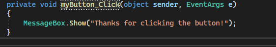
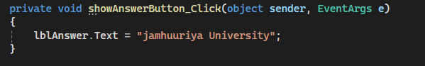
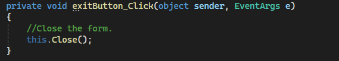

# Discouse Chapter 1
## Displaying a Message Using MessageBox

When the user clicks the Click Me button, the myButton_Click event runs
and displays a message box with the text "Thanks for clicking the button!".

### Code

```csharp
private void myButton_Click(object sender, EventArgs e)
{
    // Display a message box
    MessageBox.Show("Thanks for clicking the button!");
}
```

### Output




## Displaying Text in a Label

When the user clicks the Show Answer button, the showAnswerButton_Click event runs
and displays the text "Jamhuuriya University" in the answerLabel control.

### Code

```csharp
private void showAnswerButton_Click(object sender, EventArgs e)
{
    // Assign a string to the Text property of answerLabel to display it
    answerLabel.Text = "Jamhuuriya University";
}
```

### Output





## Closing an Application's Form

When the user clicks the Exit button, the exitButton_Click event runs
and closes the form using this.Close().

### Code

```csharp
private void exitButton_Click(object sender, EventArgs e)
{
    // Close the form.
    this.Close();
}
```

### Output


